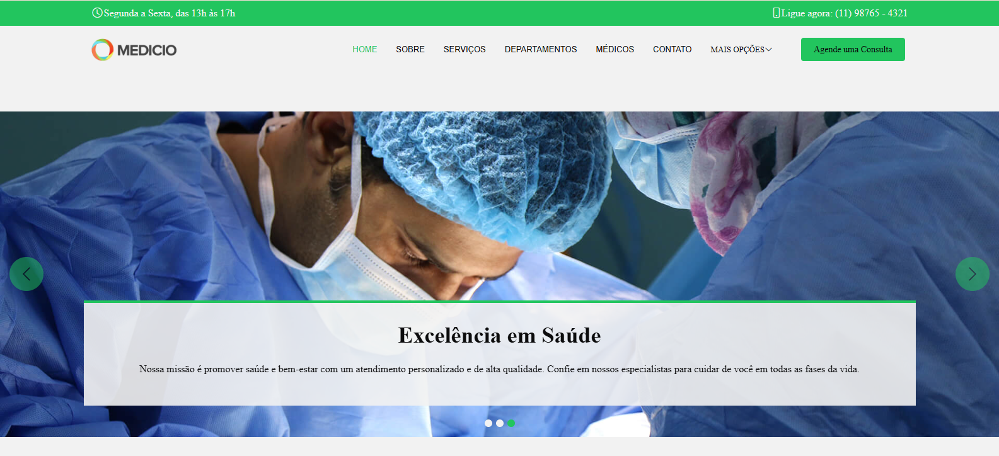
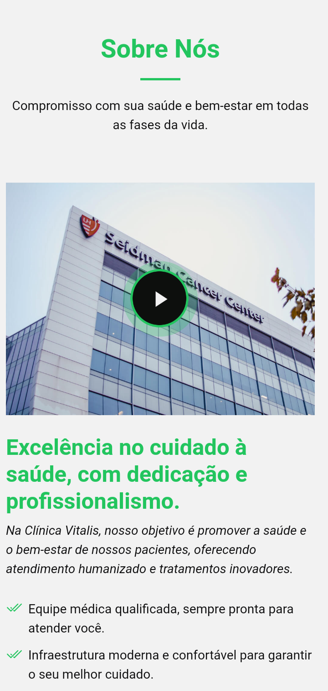

<h1 align="center">🩺 Projeto Med - Site Educacional</h1>

  
  &nbsp;&nbsp;&nbsp;
  
  &nbsp;&nbsp;&nbsp;
  

---

<h3 align="center">📌 Sumário</h3>

<table align="center">
  <tr>
    <th>🔢 Ordem</th>
    <th>📂 Seção</th>
  </tr>
  <tr><td align="center">1</td><td>📝 <a href="#descricao">Descrição</a></td></tr>
  <tr><td align="center">2</td><td>🖥️ <a href="#tecnologias-e-ferramentas-utilizadas">Tecnologias e Ferramentas Utilizadas</a></td></tr>
  <tr><td align="center">3</td><td>⚙️ <a href="#funcionalidades">Funcionalidades</a></td></tr>
  <tr><td align="center">4</td><td>📱 <a href="#responsividade">Responsividade</a></td></tr>
  <tr><td align="center">5</td><td>🖼️ <a href="#previsao-do-projeto">Prévia do Projeto</a></td></tr>
  <tr><td align="center">6</td><td>📚 <a href="#aprendizados">Aprendizados</a></td></tr>
  <tr><td align="center">7</td><td>🚀 <a href="#como-rodar-o-projeto">Como Rodar o Projeto</a></td></tr>
  <tr><td align="center">8</td><td>👨🏽‍💻 <a href="#autor">Autor</a></td></tr>
</table>

---

<h3 id="descricao" align="center">📝 Descrição</h3>

 Projeto educacional desenvolvido com foco na prática de <strong>HTML</strong>, <strong>CSS</strong>, <strong>JavaScript</strong> e <strong>Bootstrap</strong>. Nele, desenvolvi:

- Estruturação semântica de páginas com **HTML5**;
- Estilização moderna e responsiva com **CSS3**;
- Interatividade utilizando **JavaScript puro**;
- Utilização do framework **Bootstrap** para facilitar a construção do layout com componentes prontos;
- Adoção de boas práticas de **clean code** e **acessibilidade**.

Todo o desenvolvimento foi realizado no <strong>Visual Studio Code</strong>.

---

<h3 id="tecnologias-e-ferramentas-utilizadas" align="center">🖥️ Tecnologias e Ferramentas Utilizadas</h3>

<table align="center">
  <tr>
    <th>🧩 Linguagens</th>
    <th>📦 Framework</th>
    <th>🛠️ Ferramenta</th>
  </tr>
  <tr>
    <td align="center">
      
      &nbsp;
      
      &nbsp;
      
    </td>
    <td align="center">
      
    </td>
    <td align="center">
      
    </td>
  </tr>
</table>

---

<h3 id="funcionalidades" align="center">⚙️ Funcionalidades</h3>

#### 🧱 Estrutura
- ✅ Página inicial com apresentação institucional da clínica;
- ✅ Menu de navegação fixo no topo da página, adaptado para diferentes dispositivos.

#### 🎨 Estilo e Visual
- ✅ Estilo visual moderno com animações em **CSS**;
- ✅ Design responsivo para dispositivos móveis e desktops.

#### 🖱️ Interações
- ✅ Seção de serviços com cards informativos;
- ✅ Formulário de contato funcional com validação básica em **JavaScript**;
- ✅ Scroll suave e animações com **JavaScript puro**.

---

<h3 id="responsividade" align="center">📱 Responsividade</h3>

  O layout é <strong>responsivo</strong> e se adapta a diferentes tamanhos de tela. Para isso, foram utilizados:

- 📐 **Media queries** para adaptação do layout;  
- 🌍 Componentes responsivos do **Bootstrap** (grid, containers, etc.);  
- 👉🏽 Interface otimizada para dispositivos com telas sensíveis ao toque.

---

<h3 id="previsao-do-projeto" align="center">🖼️ Prévia do Projeto</h3>

<h4 align="center">💻 Versão Desktop</h4>

  

<h4 align="center">📲 Versão Mobile</h4>

  

---

<h3 id="aprendizados" align="center">📚 Aprendizados</h3>

Durante o desenvolvimento do projeto, consolidei diversos conceitos essenciais de <strong>front-end</strong>, incluindo:

- Utilização de **HTML semântico** para melhorar a acessibilidade;  
- Criação de animações suaves com **transições em CSS**;  
- Implementação de interações com **JavaScript puro**;  
- Aplicação prática do **Bootstrap** para construção de layouts responsivos;  
- Organização do código seguindo os princípios de **clean code**.

---

<h3 id="como-rodar-o-projeto" align="center">🚀 Como Rodar o Projeto</h3>

  Para visualizar o site em funcionamento, clique neste link: 👉🏽  
  <a href="https://ygorfnascimento.github.io/Projeto-Med/" target="_blank"><strong>Acesse aqui! - Projeto Med</strong></a>

---

<h3 id="autor" align="center">👨🏽‍💻 Autor</h3>

  Desenvolvido por <a href="https://www.linkedin.com/in/ygorferreiradonascimentosilva" target="_blank"><strong>Ygor Ferreira</strong></a>

